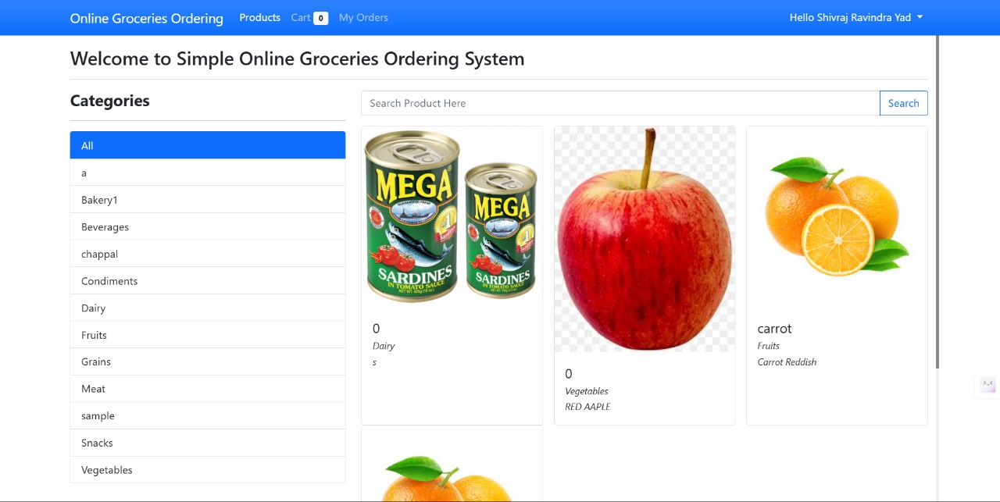
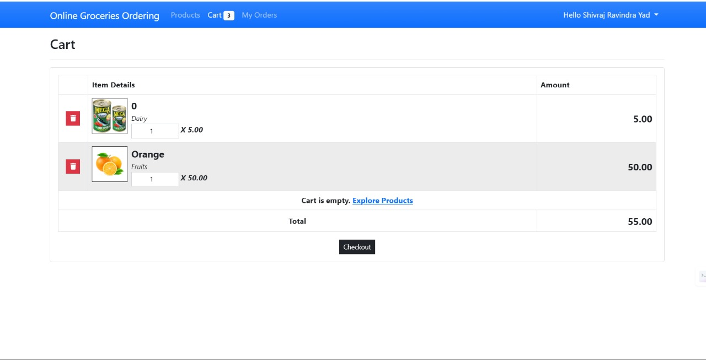

# 🛒 Grocery Ordering Web Application  

A user-friendly web application designed to simplify online grocery shopping. Built using **HTML**, **CSS**, **JavaScript**, and **PHP**, it offers a seamless experience with a responsive design and secure backend functionality.  

---

## 🚀 Project Overview  
This project allows users to browse, add items to the cart, place orders, and manage deliveries. It streamlines grocery shopping for both customers and business owners.

---

## ✨ Features  
- **Secure Login/Signup**: User authentication with PHP and MySQL.  
- **Product Browsing**: Explore groceries with details and prices.  
- **Cart Management**: Add, remove, and review items in the cart.  
- **Order Tracking**: View past orders and track current ones.  
- **Delivery Fee Calculation**: Automated inclusion of delivery fees.  

---

## 🛠️ Technologies Used  
- **Frontend**:  
  - HTML, CSS, JavaScript  
  - Tailwind CSS/Bootstrap for styling  

- **Backend**:  
  - PHP for server-side scripting  
  - MySQL for database management  

---

## 📸 Screenshots  

### Homepage  
  

### Cart Page  
  


---

## ⚙️ Setup Instructions  
1. Clone the repository:  
   ```bash  
   git clone https://github.com/yourusername/grocery-ordering-app.git  

